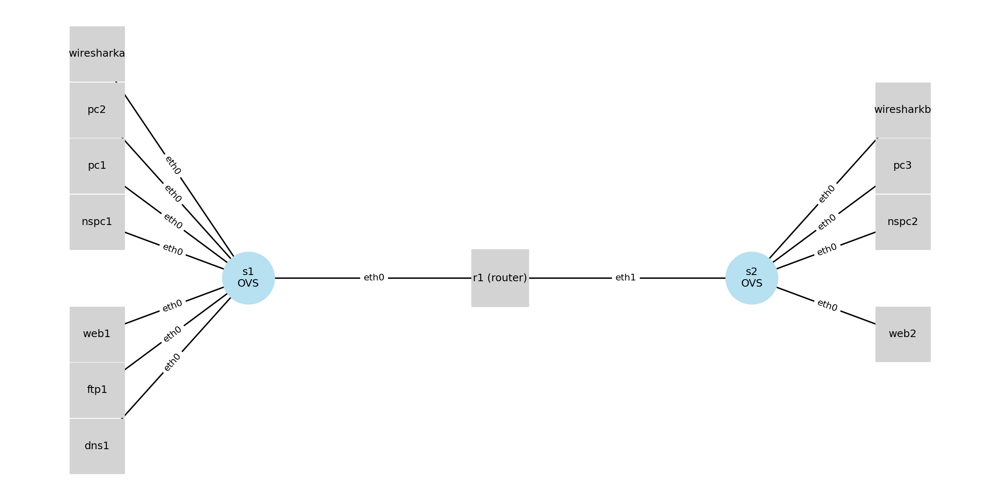

# netforlab-2lan-kathara

`netforlab-2lan-kathara` is a standalone, classroom-ready network forensics lab built with Kathara.
It implements a two-LAN topology (`192.168.0.0/24` and `192.168.5.0/24`) interconnected by `r1`, with per-LAN OVS switches and mirrored Wireshark sensors for traffic analysis.

## Learning Goals

- Observe L2/L3 traffic in segmented LANs.
- Capture and analyze DNS, HTTP, FTP, and ICMP traffic.
- Compare endpoint captures with mirrored switch-port captures.
- Practice basic incident-style workflows (traffic triage and suspicious activity identification).

## Topology

- LAN A (`192.168.0.0/24`): `dns1`, `ftp1`, `web1`, `nspc1`, `pc1`, `pc2`, router `r1`
- LAN B (`192.168.5.0/24`): `web2`, `nspc2`, `pc3`, router `r1`
- `s1` and `s2` are OVS switches (`kathara/sdn`), one per LAN.
- `wiresharka` and `wiresharkb` receive mirrored traffic from `s1` and `s2` respectively.



## Requirements

- Linux host (recommended for Kathara networking features)
- Docker
- Kathara

Quick setup on Ubuntu/Debian:

```bash
./scripts/install_lab_dependencies.sh
```

This installer follows the official Debian-based Kathara apt installation flow, only adds missing dependencies (including `tmux`), and skips Docker installation by default to avoid conflicts in environments where Docker is already provided.

To use tmux without editing `kathara.conf`, pass the terminal emulator on the command line:

```bash
kathara lstart --terminal-emu TMUX
```

To access VNC devices from the browser, start the bundled noVNC proxies:

```bash
./scripts/start_novnc_proxies.sh start
```

Quick start (lab + browser access):

```bash
kathara lstart --terminal-emu TMUX && ./scripts/start_novnc_proxies.sh start
```

Quick stop (proxies + lab cleanup):

```bash
./scripts/start_novnc_proxies.sh stop && kathara lclean
```

Then open:

- `http://localhost:6082/vnc.html?host=localhost&port=6082` (`pc2`)
- `http://localhost:6083/vnc.html?host=localhost&port=6083` (`pc3`)

Manage proxy lifecycle:

```bash
./scripts/start_novnc_proxies.sh status
./scripts/start_novnc_proxies.sh stop
```

Optional (for local diagram regeneration):

- Python 3.10+
- `networkx`, `matplotlib` (used by `scripts/render_diagram.py`)
- Create a local venv and install modules with:

```bash
./scripts/setup_python_venv.sh
```

## Build Images

From the lab directory:

```bash
docker build -t netfor-alpine-netsec dockerfiles/alpine-netsec
docker build -t netfor-alpine-pc dockerfiles/alpine-pc
docker build -t netfor-alpine-pc-fluxbox dockerfiles/alpine-pc-fluxbox
docker build -t netfor-dnsmasq dockerfiles/dnsmasq
docker build -t netfor-vsftpd dockerfiles/vsftpd
docker build -t netfor-webnginx dockerfiles/webnginx
```

## Start / Stop the Lab

```bash
cd netforlab-2lan-kathara
kathara lstart --terminal-emu TMUX
```

Stop and clean:

```bash
kathara lclean
```

## TMUX Terminal Usage

If you start with TMUX terminal emulation:

```bash
kathara lstart --terminal-emu TMUX
```

Attach to the Kathara tmux session:

```bash
tmux attach -t Kathara
```

Useful tmux navigation:

- `Ctrl+b w` list windows (devices) and select one
- `Ctrl+b n` / `Ctrl+b p` next/previous window
- `Ctrl+b d` detach from session (lab keeps running)

### Show specific devices side by side

Recommended approach (safe, does not modify existing Kathara device windows):

1. Create a compare window in the same tmux session:

```bash
tmux new-window -t Kathara -n compare
```

2. Connect first device in pane 0:

```bash
tmux send-keys -t Kathara:compare.0 "kathara connect r1" C-m
```

3. Split vertically and connect second device in pane 1:

```bash
tmux split-window -h -t Kathara:compare
tmux send-keys -t Kathara:compare.1 "kathara connect web1" C-m
```

You can replace `r1` and `web1` with any device names from the lab.

## Access

- noVNC browser access (for VNC-enabled devices):
	- Start proxies:

		```bash
		./scripts/start_novnc_proxies.sh start
		```

	- Open in browser:
		- `http://localhost:6082/vnc.html?host=localhost&port=6082` (`pc2`)
		- `http://localhost:6083/vnc.html?host=localhost&port=6083` (`pc3`)

	- Check or stop proxies:

		```bash
		./scripts/start_novnc_proxies.sh status
		./scripts/start_novnc_proxies.sh stop
		```

- VNC desktop nodes:
	- `pc2`: `localhost:5922`
	- `pc3`: `localhost:5923`
- Wireshark web UIs:
	- `wiresharka`: `http://localhost:3000`
	- `wiresharkb`: `http://localhost:3001`

## Lab Structure

- `lab.conf`: topology and node/image wiring
- `*.startup`: node boot configuration (IPs, routes, services, OVS setup)
- per-node directories (e.g., `dns1/`, `ftp1/`, `web1/`): files injected into device filesystems by Kathara

## Suggested Forensics Exercises

### 1) Baseline Traffic Mapping

1. Start captures on `wiresharka` and `wiresharkb`.
2. From `pc1`, ping `web1`, then `web2`.
3. Identify ARP, DNS, ICMP, and routed traffic across LAN A vs LAN B.

### 2) DNS Resolution Analysis

1. From `pc2`, run lookups for `web1.netforlab.net` and `web2.netforlab.net`.
2. Inspect DNS query/response pairs and timing.
3. Compare endpoint capture (`tcpdump` on client) with switch-mirrored capture.

### 3) Web and FTP Protocol Observation

1. Browse web pages on `web1`/`web2` from `pc2` or `pc3`.
2. Connect to FTP server `ftp1` and transfer sample files.
3. Extract indicators from captures (hosts, URIs, commands, transfers).

### 4) Basic Suspicious Activity Simulation

1. Run `python3 /root/scripts/syn_flood.py <target_ip> --port 80 --count 30` from `nspc1` or `nspc2`.
2. Capture on mirrored Wireshark nodes.
3. Build a short incident timeline (source, destination, protocol, frequency).

Detailed exercise handout: `EXPERIMENTS.md`.

## Useful Commands

- Enter a node shell:

```bash
kathara connect pc1
```

- Quick endpoint capture:

```bash
tcpdump -n -i eth0
```

- Regenerate diagram:

```bash
python scripts/render_diagram.py
```

## Classroom Use Notes

- This lab is intended for defensive security education and authorized experimentation only.
- Run exercises in isolated environments and follow your institution's acceptable-use policy.

## Script Requirements

- `syn_flood.py` requires Python 3 and Scapy.
- The default `netfor-alpine-netsec` image already includes both requirements.
